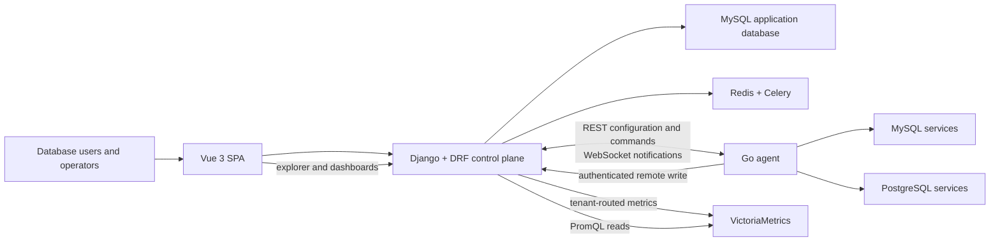

# Datamingle

**Database operations, governance, and observability in one control plane.**

[](https://github.com/jruszo/Datamingle)
[](backend/src/docker/Dockerfile.local-dev)
[](backend/requirements.txt)
[](frontend/package.json)
[](agent/go.mod)
[](LICENSE)

<!-- markdownlint-disable MD013 -->

Datamingle gives database teams a shared place to understand their estate,
observe database and host health, run controlled queries, and move risky changes
through review and execution. It combines a Django control plane, a Vue SPA, and
a Go agent that runs close to managed databases.

The project is under active development. The Docker environment documented
below is the supported development and evaluation path; it is not a production
deployment recipe.

## What Datamingle Includes

### Database inventory and topology

- Model infrastructure nodes, database services, teams, environments, and
  ownership in a single catalog.
- Register MySQL and PostgreSQL services and test connectivity through an
  assigned agent.
- Collect engine version and server identity during inventory refreshes.
- Discover MySQL replication and Group Replication topology, identify writable
  primaries, and block DDL/DML against replicas or ambiguous clusters.
- Record PostgreSQL primary/replica role from `pg_is_in_recovery()` inventory
  data.
- Attach stable monitoring labels to nodes and services.

### Metrics and dashboards

- Collect host metrics with `node_exporter` and database metrics with
  `mysqld_exporter` or `postgres_exporter` under agent supervision.
- Send Prometheus remote-write data through Datamingle's authenticated,
  organization-aware ingest endpoint to VictoriaMetrics.
- Explore metric names, label values, metadata, instant queries, and range
  queries with PromQL.
- Filter metrics by infrastructure and database labels, format PromQL, and
  visualize returned time series.
- Build shared dashboards with PromQL panels, time ranges, auto-refresh,
  template variables, favorites, full-screen panels, and saved revision history.
- Restore previous dashboard revisions and preserve a draft if another user
  changes the same dashboard.
- Optionally enable the metrics assistant by configuring an OpenAI-compatible
  endpoint in the backend environment.

### Queries and governed changes

- Run read-only MySQL and PostgreSQL queries through a command-capable agent.
- Browse database metadata from the query workspace, format SQL, limit result
  size, and review execution details.
- Search query history and save useful queries with aliases and favorites.
- Submit DDL, DML, and data-export requests with a fresh SQL check before
  submission.
- Define reusable, ordered approval policies and assign them to database
  services.
- Approve, reject, cancel, schedule, and execute eligible workflows with a full
  operation history.
- Export governed query results as CSV, TSV, SQL, or XLSX.
- Run one-time or scheduled, approval-controlled archive/purge workflows.
- Use direct MySQL DDL or optional `gh-ost` and
  `pt-online-schema-change` execution; MySQL archives use `pt-archiver`.

### Access, audit, and operations

- Authenticate SPA users with django-allauth headless JWT email/password flows.
- Control visibility and actions through permission levels, teams, service
  assignments, and temporary or permanent access grants.
- Route approval and execution work to an in-product mailbox.
- Audit user activity, SQL workflows, query access, and workflow operations.
- View operational reports and a database-focused home overview.
- Manage the MySQL data dictionary, accounts, server parameters, sessions,
  transactions, locks, and tablespace information where supported.
- Create and revoke agents, rotate one-time agent credentials, manage service
  assignments, inspect command events, and cancel active commands.

## Supported Database Surface

The actively supported agent command path is MySQL and PostgreSQL. Other legacy
engine connectors remain in the backend, but they are not considered part of
the current agent-backed product surface.

| Capability | MySQL | PostgreSQL | Notes |
| --- | --- | --- | --- |
| Agent connection and inventory | Yes | Yes | Identity, version, and connectivity |
| Host and service metrics | Yes | Yes | Prometheus exporters and remote write |
| Topology awareness | Yes | Partial | MySQL cluster discovery; PostgreSQL primary/replica role |
| Read-only online queries | Yes | Yes | Executed by the assigned agent |
| Governed DDL/DML | Yes | Yes | Direct execution for both engines |
| Online schema-change tools | Yes | No | `gh-ost` and `pt-online-schema-change` are MySQL-only |
| Governed data exports | Yes | Yes | CSV, TSV, SQL, and XLSX |
| Archive/purge workflows | Yes | Yes | `pt-archiver` for MySQL; agent-native batched deletion for PostgreSQL |
| Data dictionary | Yes | No | Uses the backend engine connection |
| Account, parameter, and session operations | Yes | No | Uses the backend engine connection |

Agent-backed features fail closed when an agent is offline, disabled, not
assigned, not command-enabled, or has no active websocket connection.

## Architecture



Datamingle stores users, inventory, policies, workflows, and audit state in the
application database. Time-series samples stay in VictoriaMetrics rather than
being copied into Django.

The optional shared development stack also includes Quickwit, Jaeger, Grafana,
and MinIO. They provide a local telemetry lab for logs and traces, but metrics
are the observability signal currently integrated into the Datamingle product
UI.

## Local Quick Start

### Prerequisites

- Git
- Docker Engine or Docker Desktop
- Docker Compose v2 with the `docker compose` command
- At least 8 GB of memory available to Docker for the full three-stack setup
- These host ports available:

| Service | Port |
| --- | ---: |
| Vue frontend | `5173` |
| Django/nginx API | `9123` |
| Application MySQL | `3306` |
| Demo MySQL | `3307` |
| Demo PostgreSQL | `5433` |
| Grafana | `3000` |
| VictoriaMetrics | `8428` |
| Shared Redis | `6379` |
| Quickwit HTTP / OTLP gRPC | `7280` / `7281` |
| Jaeger UI | `16686` |
| MinIO API / console | `9000` / `9001` |

### 1. Clone and prepare local configuration

```bash
git clone https://github.com/jruszo/Datamingle.git
cd Datamingle

docker network inspect datamingle >/dev/null 2>&1 || docker network create datamingle
cp backend/src/docker-compose/.env.example backend/src/docker-compose/.env.local-dev
```

Generate development-only values for the two required secrets:

```bash
python3 - <<'PY'
import base64
import os
import secrets

print("SECRET_KEY=" + secrets.token_urlsafe(50))
print("FIELD_ENCRYPTION_KEYS=" + base64.urlsafe_b64encode(os.urandom(32)).decode())
PY
```

Replace the placeholder values for `SECRET_KEY` and
`FIELD_ENCRYPTION_KEYS` in
`backend/src/docker-compose/.env.local-dev` with the generated values. The local
file is ignored by Git; do not commit it.

The remaining example values are suitable only for local development. Review
them before exposing any service beyond your machine.

### 2. Start the stacks

Start the optional observability stack first so the metrics backend is ready:

```bash
docker compose -f shared-infra/docker-compose.yml up -d
```

Start the MySQL and PostgreSQL databases used by the seeded examples:

```bash
docker compose -f backend/src/docker-compose/docker-compose.demo-dbs.yml up -d
```

Build and start the application database, Redis, Django, Celery worker, Celery
Beat, and Vue frontend:

```bash
docker compose -f backend/src/docker-compose/docker-compose.local-dev.yml up -d --build
```

The first application start applies Django migrations, collects static assets,
and runs the idempotent local demo seed. Follow startup progress with:

```bash
docker compose -f backend/src/docker-compose/docker-compose.local-dev.yml logs -f datamingle
```

Wait until Daphne is listening, then press `Ctrl-C` to stop following the logs.

### 3. Verify the environment

```bash
docker compose -f backend/src/docker-compose/docker-compose.local-dev.yml ps
docker compose -f backend/src/docker-compose/docker-compose.demo-dbs.yml ps
docker exec -w /opt/datamingle/backend datamingle-app python manage.py smoke_local_demo
curl -fsS http://127.0.0.1:5173/ >/dev/null && echo "frontend: ready"
curl -fsS "http://127.0.0.1:8428/prometheus/api/v1/query?query=up"
```

Open [http://localhost:5173](http://localhost:5173). The frontend proxies API
requests to the backend; the backend is also reachable directly at
[http://localhost:9123](http://localhost:9123).

### 4. Create a local login

Public signup is intentionally disabled. For the fastest disposable evaluation,
seed the E2E users and fixtures:

```bash
docker exec -w /opt/datamingle/backend datamingle-app python manage.py seed_e2e_environment
```

Then sign in with:

- Email: `local-admin@datamingle.dev`
- Password: `DatamingleLocal123!`

This command creates known local test credentials and additional scenario data.
Run it only in the disposable local environment.

To create your own initial administrator instead, create a Django superuser and
register its email with allauth:

```bash
docker exec -it -w /opt/datamingle/backend datamingle-app \
  python manage.py createsuperuser \
  --username admin@datamingle.local \
  --email admin@datamingle.local

docker exec -w /opt/datamingle/backend datamingle-app \
  python manage.py shell -c \
  "from allauth.account.models import EmailAddress; from sql.models import Users; u=Users.objects.get(username='admin@datamingle.local'); EmailAddress.objects.update_or_create(user=u, email=u.email, defaults={'primary': True, 'verified': True})"
```

Sign in with the email and password entered during `createsuperuser`.

### 5. Explore the seeded environment

The local seed creates:

- `demo-mysql-workflow` on the demo MySQL stack;
- `demo-pgsql-workflow` on the demo PostgreSQL stack;
- infrastructure nodes, teams, permission levels, and single-stage and
  multi-stage approval policies;
- agent tool manifests and a MySQL agent record used by the local workflow
  fixtures.

Demo database credentials are `demo_datamingle` / `demo123`. From the host, the
demo databases are available on `127.0.0.1:3307` and `127.0.0.1:5433`.

The seed creates control-plane fixtures; it does not launch the Go agent as a
Docker service. Screens and metadata can be explored immediately, while live
agent commands and database-exporter metrics require a running agent. See
[Agent development](#agent-development) and the
[agent documentation](agent/README.md).

## Local Service URLs

| Service | URL | Local notes |
| --- | --- | --- |
| Datamingle SPA | [http://localhost:5173](http://localhost:5173) | Primary application entry point |
| Datamingle API | [http://localhost:9123](http://localhost:9123) | Normally accessed through the Vite proxy |
| VictoriaMetrics | [http://localhost:8428](http://localhost:8428) | Prometheus-compatible metrics backend |
| Grafana | [http://localhost:3000](http://localhost:3000) | Anonymous admin in the local stack |
| Quickwit | [http://localhost:7280](http://localhost:7280) | Search and OTLP development backend |
| Jaeger | [http://localhost:16686](http://localhost:16686) | Trace search backed by Quickwit |
| MinIO console | [http://localhost:9001](http://localhost:9001) | `minioadmin` / `minioadmin` locally |

## Common Development Tasks

### Rebuild the app and frontend

```bash
docker compose -f backend/src/docker-compose/docker-compose.local-dev.yml up -d --build datamingle frontend
```

The backend source tree is bind-mounted. Rebuild when dependencies, the image,
or environment-sensitive configuration changes.

### Run backend commands

Run Django and Python commands inside `datamingle-app`:

```bash
docker exec -w /opt/datamingle/backend datamingle-app python manage.py check
docker exec -w /opt/datamingle/backend datamingle-app python manage.py showmigrations
docker exec -w /opt/datamingle/backend datamingle-app python manage.py smoke_local_demo
```

### Inspect logs

```bash
docker compose -f backend/src/docker-compose/docker-compose.local-dev.yml logs -f datamingle
docker compose -f backend/src/docker-compose/docker-compose.local-dev.yml logs -f celery celerybeat
docker compose -f shared-infra/docker-compose.yml logs -f victoriametrics-local-dev
```

### Stop without deleting data

```bash
docker compose -f backend/src/docker-compose/docker-compose.local-dev.yml down
docker compose -f backend/src/docker-compose/docker-compose.demo-dbs.yml down
docker compose -f shared-infra/docker-compose.yml down
```

### Reset the disposable local environment

The following removes local Compose volumes and recreates the seeded databases.
Do not run it against an environment containing data you need:

```bash
docker compose -f backend/src/docker-compose/docker-compose.local-dev.yml down -v
docker compose -f backend/src/docker-compose/docker-compose.demo-dbs.yml down -v
docker compose -f backend/src/docker-compose/docker-compose.demo-dbs.yml up -d
docker compose -f backend/src/docker-compose/docker-compose.local-dev.yml up -d --build
```

Shared observability data is retained unless you explicitly run:

```bash
docker compose -f shared-infra/docker-compose.yml down -v
```

If you have local data from before the Archery-to-Datamingle database rename,
use the migration helper before starting the renamed stack:

```bash
scripts/docker/migrate-archery-db-to-datamingle.sh
```

## Agent Development

The Datamingle agent is a Go service intended to run close to database hosts. It
maintains a websocket for lightweight notifications, fetches full configuration
over authenticated REST, reconciles monitoring modules, and reports command
state and results back to the control plane.

Requirements and checks:

```bash
cd agent
go test ./...
go run ./cmd/datamingle-agent version
go run ./cmd/datamingle-agent config check -config /etc/datamingle-agent/agent.yaml
go run ./cmd/datamingle-agent doctor -config /etc/datamingle-agent/agent.yaml
```

The current package builder targets Linux AMD64 and bundles verified copies of
`gh-ost`, `pt-online-schema-change`, and `pt-archiver`:

```bash
cd agent
./packaging/build-package.sh
```

The archive is written to `agent/dist/`. Percona tools also require Perl DBI and
the MySQL DBI driver on the target host. See [agent/README.md](agent/README.md)
and [agent/packaging/README.md](agent/packaging/README.md) for configuration and
packaging details.

## Configuration

Local application settings live in
`backend/src/docker-compose/.env.local-dev`, copied from the tracked example.

| Variable | Purpose |
| --- | --- |
| `SECRET_KEY` | Django signing secret; required |
| `FIELD_ENCRYPTION_KEYS` | Fernet key set for encrypted database credentials; required |
| `DATABASE_URL` | Datamingle application database |
| `CACHE_URL` | Django cache connection |
| `CELERY_BROKER_URL` | Background-job broker |
| `CELERY_RESULT_BACKEND` | Background-job result store |
| `DATAMINGLE_METRICS_BACKEND_URL` | Default VictoriaMetrics read/ingest target |
| `DATAMINGLE_METRICS_TENANT_URLS` | Optional JSON map of organization IDs to VictoriaMetrics URLs |
| `OPENAI_KEY` | Enables the optional metrics assistant when set |
| `OPENAI_BASE_URL` | OpenAI-compatible API base URL |
| `OPENAI_MODEL` | Model used by the optional metrics assistant |

Agents authenticate with a per-agent key stored in the environment named by
`api_key_env` (the default is `DATAMINGLE_AGENT_API_KEY`). Raw keys are displayed
only when issued and are not written to the agent YAML configuration.

## Verification

Backend checks run in the application container:

```bash
docker exec -w /opt/datamingle/backend datamingle-app python manage.py test
docker exec -w /opt/datamingle/backend datamingle-app python manage.py makemigrations sql --check
docker exec -w /opt/datamingle datamingle-app black --check backend
```

Frontend checks run from `frontend/`:

```bash
cd frontend
npm run build
npm run test:unit
```

The full Playwright smoke suite resets the local environment, seeds E2E users,
and runs Chromium tests:

```bash
cd frontend
npm run e2e
```

Agent checks run from `agent/`:

```bash
cd agent
go test ./...
```

## Repository Layout

| Path | Contents |
| --- | --- |
| `backend/` | Django, DRF, Channels, Celery, database engines, and local Docker assets |
| `frontend/` | Vue 3, TypeScript, Vite, Pinia, ECharts, and GridStack SPA |
| `agent/` | Go agent, command executors, monitoring modules, and Linux packaging |
| `shared-infra/` | VictoriaMetrics, Quickwit, Jaeger, Grafana, MinIO, and supporting services |
| `documentation/` | Task-oriented end-user product documentation |
| `scripts/` | Docker migration and end-to-end test helpers |

## Documentation

- [User documentation](documentation/README.md)
- [Local demo details](backend/src/docker-compose/LOCAL_DEMO.md)
- [Frontend development](frontend/README.md)
- [Agent development](agent/README.md)
- [Shared observability infrastructure](shared-infra/README.md)

## Security and Deployment Notes

- The checked-in passwords and API key used by the demo seed are local-only
  fixtures. Never reuse them in a shared or production environment.
- Public signup is closed. Administrators create users and assign permission
  levels and teams.
- Database credentials are encrypted at rest with `FIELD_ENCRYPTION_KEYS` and
  sent only to authorized agents in their scoped configuration.
- Agent API keys are stored as hashes in Django; the raw value is shown only at
  issuance or rotation.
- Use TLS for the browser, API, agent REST, websocket, and metrics-ingest paths
  outside local development.
- Replace the demo databases, local filesystem downloads, development nginx,
  and anonymous observability access before a production deployment.
- Back up the application database, exported files, telemetry stores, and field
  encryption keys as separate operational concerns.

## License and Attribution

Datamingle is licensed under the [Apache License 2.0](LICENSE).

Datamingle is a fork of [Archery](https://github.com/hhyo/Archery). Original
copyright and license notices are retained in accordance with that license.
